<h1 align="center">Hi there 👋, I am @fishwww-ww</h1>

## 🧑‍💻 About Me
🌱 I am currently an undergraduate student majoring in **Artificial Intelligence**.

🔭 I have a deep passion for **AI, Agent & Network technology**.

🤔 I love building products as both a product manager and a developer.

## 📬 Let's Connect
🌐 You can reach me at fish3w.2w@gmail.com.

---

<table><tr>
  <td>
    
  </td>
  <td>
    
  </td>
</tr></table>

